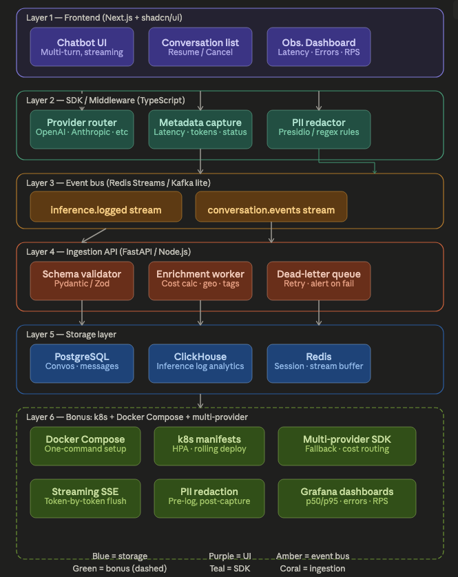

# 🫒 OlliveTrace

A production-grade LLM inference logging and ingestion system built for massive scale, zero-latency overhead, and deep observability.



> **The Goal:** Provide a seamless, multi-provider LLM chatbot experience while asynchronously capturing deep telemetry (latency, tokens, costs, and PII-redacted payloads) without ever blocking the user's hot-path.

---

## 🛠️ Setup Instructions

OlliveTrace is fully containerized. A single command boots the entire architecture.

1. **Configure Environment Variables**
   Rename `.env.example` to `.env` in the root directory and populate your provider API keys:
   ```bash
   cp .env.example .env
   ```
   *Note: Add your `ANTHROPIC_API_KEY`, `OPENAI_API_KEY`, and `GOOGLE_API_KEY` to test the multi-provider routing.*

2. **Start the Infrastructure**
   Launch all 7 microservices (Next.js, FastAPI, Redis, Postgres, ClickHouse, Prometheus, Grafana) via Docker Compose:
   ```bash
   docker compose up --build -d
   ```

3. **Access the Applications**
   - 💬 **Next.js Frontend (Chat & Dashboard)**: [http://localhost:3000](http://localhost:3000)
   - 📊 **Grafana (Observability Metrics)**: [http://localhost:3001](http://localhost:3001) *(Login: `admin` / Password: `admin`)*
   - ⚙️ **FastAPI Ingestion API**: [http://localhost:8000/docs](http://localhost:8000/docs) *(Swagger UI)*

*Note: ClickHouse and Postgres will automatically run their respective table migrations located in `db/clickhouse/init.sql` and `db/migrations/V1__initial_schema.sql` on boot.*

---

## 🏗️ Architecture Overview

OlliveTrace consists of 6 explicit layers designed for separation of concerns:

1. **Frontend**: A Next.js 14 App Router application with shadcn/ui and Tailwind CSS, featuring a multi-turn Chatbot UI with SSE streaming, a conversation manager, and an observability dashboard with Recharts.
2. **SDK / Middleware**: A lightweight TypeScript SDK that handles multi-provider routing (OpenAI, Anthropic, Google), metadata capture (TTFB, total latency, token counts), and **PII redaction** (scrubbing sensitive regex before logging).
3. **Event Bus (Redis Streams)**: A lightweight Kafka alternative that decouples the UI from the DB. It maintains two main streams: `inference:logged` for telemetry logs and `conversation:events` for session lifecycle state.
4. **Ingestion API**: A FastAPI backend featuring asynchronous Python workers that poll Redis Consumer Groups. One worker writes inference logs into ClickHouse (for analytical querying), and the other upserts conversation state into PostgreSQL.
5. **Storage Layer**: 
   - **PostgreSQL**: For storing normalized conversation and message metadata.
   - **ClickHouse**: An append-only MergeTree configuration optimized for high-volume inference logs.
6. **Infrastructure**: Full Docker Compose local setup, paired with Kubernetes manifests (`/k8s`) for production deployment (HPA, rolling updates).

*(For a deeper dive into logging strategies and scaling, see [ARCHITECTURE.md](./ARCHITECTURE.md))*

---

## 🗄️ Schema Design Decisions

- **Why Postgres for conversations/messages?** We needed a relational database to maintain ACID properties, enforce strict foreign key constraints (e.g., raw messages belonging to a specific conversation), and handle easy upserts for session states (`active`, `completed`, `cancelled`).
- **Why ClickHouse for inference logs?** Inference telemetry data is exceptionally high-volume and strictly append-only. ClickHouse's columnar architecture allows for lightning-fast aggregations (e.g., calculating p95 latency or throughput over millions of rows) in milliseconds, which powers the real-time React observability dashboard without crashing.
- **Why Redis Streams over Kafka?** Redis is significantly lighter to operate than Kafka for small-to-medium deployments, while still providing robust built-in **Consumer Group** semantics, message acknowledgment (`XACK`), and a dead-letter queue (via `XAUTOCLAIM`) for fault tolerance.

---

## ⚖️ Tradeoffs Made

- **Two databases vs one:** Managing both Postgres and ClickHouse dramatically increases operational complexity (backups, migrations, tuning). However, the query performance tradeoff is worth it for analytical dashboarding, as a purely relational DB would eventually choke on massive telemetry aggregations.
- **Fire-and-forget logging vs synchronous writes:** The SDK writes logs to Redis asynchronously without `await`ing acknowledgment in the hot path. This explicitly prioritizes the user's chatbot latency over absolute 100% log completeness in the event of a total network failure between the Node app and Redis.
- **90-day TTL on ClickHouse:** Using a Time-To-Live (TTL) controls storage costs. While historical analysis > 90 days is sacrificed, observability focuses on recent operational health. Long-term data would require a separate cold-storage archiving strategy (e.g., S3).

---

## 🔮 What I Would Improve With More Time

1. **OpenTelemetry Distributed Traces:** Integrate standard OTel spans to trace requests end-to-end across the Next.js frontend, SDK middleware, and LLM provider endpoints, rather than relying solely on custom telemetry logic.
2. **Per-User Cost Budget Alerts:** Add logic in the FastAPI ingestion workers to aggregate estimated costs per user and emit alerts (via webhook/Slack) if a daily/monthly dollar threshold is exceeded.
3. **Model Evaluation Feedback:** Implement a feedback mechanism (thumbs up/down) directly in the Chat UI, sending a separate `turn.evaluated` event to append human-in-the-loop (RLHF) quality scores to the telemetry.
4. **Webhook Delivery for DLQ:** Expose a Slack/PagerDuty integration that automatically triggers when poisoned payloads fall into the `inference:dlq` (Dead Letter Queue) stream, ensuring immediate developer visibility.
